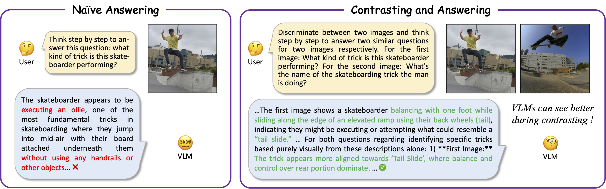
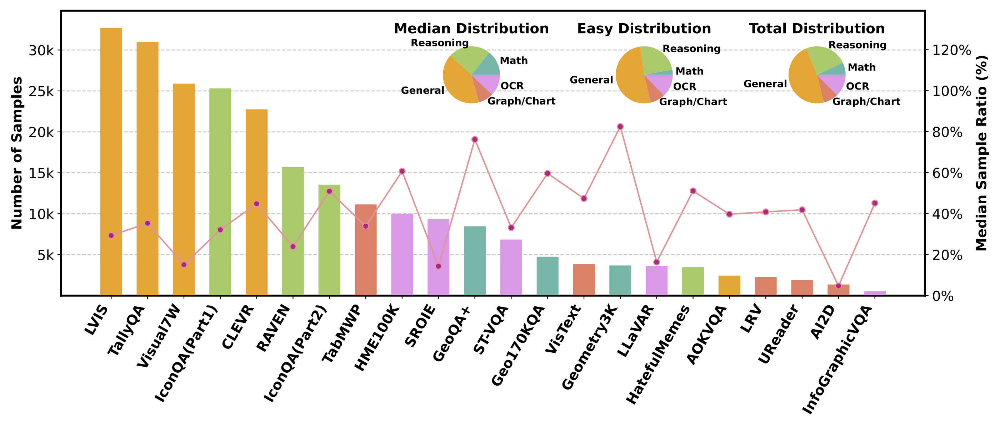
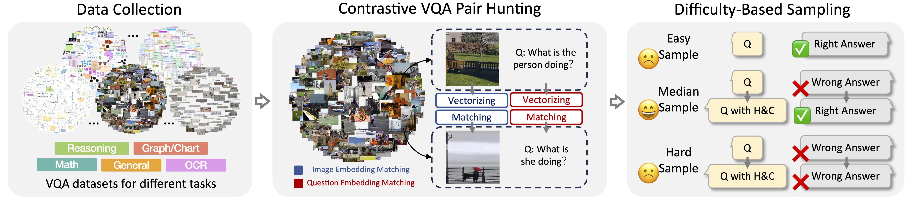
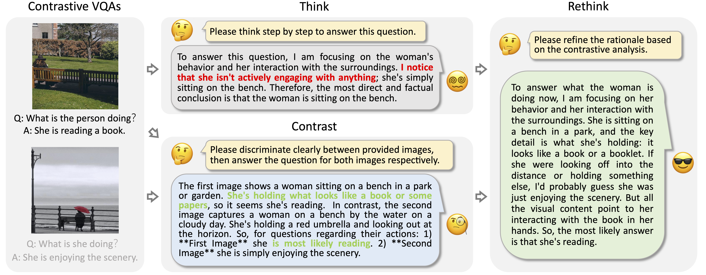
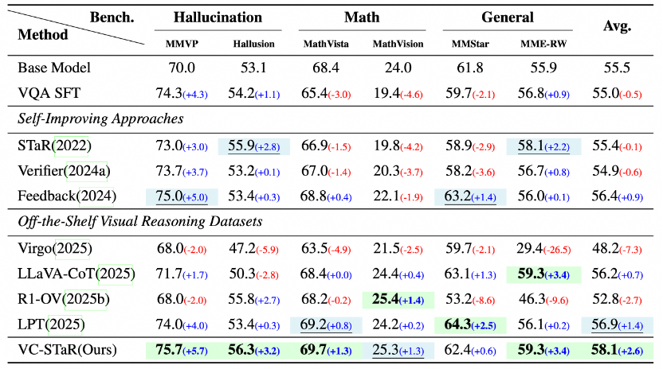

<div align="center">

<h1>
  Through the Lens of Contrast: <br> 
  Self-Improving Visual Reasoning in VLMs
</h1>

<h3>
  ICLR 2026 Oral
</h3>

<!-- Author Information Section -->
<p>
  <!-- Authors -->
  <a href="https://scholar.google.com.hk/citations?user=X1AP9ZEAAAAJ&hl=zh-CN">Zhiyu Pan</a><sup>1,2,*</sup>&nbsp;&nbsp;&nbsp;&nbsp;
  <a href="https://scholar.google.com.hk/citations?user=0_iF4jMAAAAJ&hl=zh-CN">Yizheng Wu</a><sup>2,*</sup>&nbsp;&nbsp;&nbsp;&nbsp;
  <a href="https://scholar.google.com.hk/citations?user=M9R2tDYAAAAJ&hl=zh-CN">Jiashen Hua</a><sup>2,†</sup>&nbsp;&nbsp;&nbsp;&nbsp;
  <a href="https://scholar.google.com.hk/citations?user=NtNbvGAAAAAJ&hl=zh-CN">Junyi Feng</a><sup>2,</sup>&nbsp;&nbsp;&nbsp;&nbsp;
  <br>
  <a href="https://scholar.google.com.hk/citations?hl=zh-CN&user=sBhbb2wAAAAJ">Shaotian Yan</a><sup>2,</sup>&nbsp;&nbsp;&nbsp;&nbsp;
  <a href="https://scholar.google.com/citations?user=VQp_ye4AAAAJ&hl=zh-CN">Bing Deng</a><sup>2,</sup>&nbsp;&nbsp;&nbsp;&nbsp;
  <a href="https://scholar.google.com.hk/citations?user=396o2BAAAAAJ&hl=zh-CN">Zhiguo Cao</a><sup>1,</sup>&nbsp;&nbsp;&nbsp;&nbsp;
  <a href="https://scholar.google.com/citations?user=T9AzhwcAAAAJ&hl=en">Jieping Ye</a><sup>2</sup>
  <br><br>
  <!-- Affiliations -->
  <sup>1</sup>Huazhong University of Science and Technology&nbsp;&nbsp;&nbsp;&nbsp;
  <sup>2</sup>Alibaba Cloud&nbsp;&nbsp;&nbsp;&nbsp;
  <br>
  <!-- Legend -->
  <em><small><sup>*</sup>Same contribution&nbsp;&nbsp;&nbsp;&nbsp;<sup>†</sup>Corresponding author and project leader</small></em>
</p>

<p>
  <a href="https://arxiv.org/abs/2603.02556">
    
  </a>
  <!-- <a href="#">
    
  </a>
  <a href="#">
    
  </a> -->
</p>

</div>

## 🔥 Updates

- **Feb 06, 2026**: 🎉 VC-STaR has been selected as **ICLR 2026 Oral**!
- **Mar 26, 2026**: 📊 VisCoR-55K dataset is being organized and will be released soon.
- **Mar 26, 2026**: 🤖 Model checkpoints are being prepared. Stay tuned!

## 🚩 Table of Contents
- [Abstract](#abstract)
- [Framework](#framework)
- [Contrastive VQA Pair Curation](#curation)
- [Rationale Generation](#cot)
- [VisCoR-55K Dataset](#dataset)
- [Performance](#performance)
- [Citatioin](#citation)

## <a id="abstract"></a>📖 Abstract

Reasoning has emerged as a key capability of LLMs. In linguistic tasks, this capability can be enhanced by self-improving techniques that refine reasoning paths for subsequent finetuning. However, extending these language-based self-improving approaches to VLMs presents a unique challenge: visual hallucinations in reasoning paths cannot be effectively verified or rectified. Our solution starts with a key observation about visual contrast: __when presented with a contrastive VQA pair, *i.e*., two visually similar images with synonymous questions, VLMs identify relevant visual cues more precisely.__ Motivated by this observation, we propose **V**isual **C**ontrastive **S**elf-**Ta**ught **R**easoner (VC-STaR), a novel self-improving framework that leverages visual contrast to mitigate hallucinations in model-generated rationales. We collect a diverse suite of VQA datasets, curate contrastive pairs according to multi-modal similarity, and generate rationales using VC-STaR. Consequently, we obtain a new visual reasoning dataset, VisCoR-55K, which is then used to boost the reasoning capability of various VLMs through supervised finetuning. Extensive experiments show that VC-STaR not only outperforms existing self-improving approaches but also surpasses models finetuned on the SoTA visual reasoning datasets, demonstrating that the inherent contrastive ability of VLMs can bootstrap their own visual reasoning. 

<p align="center">
  
</p>

## <a id="framework"></a>📝 Framework of VC-STaR

Our work is built upon a key observation: **VLMs can see better through the lens of contrast.** When presented with a contrastive VQA pair (two visually similar images with synonymous questions), models can identify relevant visual cues more precisely. To leverage this capability, the **VC-STaR** framework operates in three main stages:

### 1. Contrastive VQA Pair Curation
We start by collecting a diverse suite of VQA datasets covering general, reasoning, math, graph/chart, and OCR. We then curate **Contrastive VQA Pairs** based on multi-modal similarity.

### 2. Rationale Generation
Using the curated pairs, we generate high-quality rationales (reasoning paths) through our **Thinking, Contrasting and Rethinking** pipeline. This process results in **VisCoR-55K**, a high-quality visual reasoning dataset containing 55k samples with faithful rationales.

### 3. Supervised Finetuning
Finally, we use the **VisCoR-55K** dataset to finetune [Qwen2.5-VL](https://huggingface.co/collections/Qwen/qwen25-vl). We employ LLaMA-Factory to perform **full-parameter finetuning**. For detailed instructions, please refer to the official [LLaMA-Factory](https://github.com/hiyouga/LLaMA-Factory) repository.

## <a id="curation"></a>🆚 Contrastive VQA Curation

To construct **Contrastive VQA Pairs**, we designed a curation pipeline that filters samples based on both **reasoning difficulty** and **multi-modal similarity**.

### 1. Diverse Data Collection
We collected a diverse pool of **21 VQA datasets** spanning **5 distinct categories** to ensure the generalization capability of our model.

* **General**: [LVIS](https://github.com/X2FD/LVIS-INSTRUCT4V), [TallyQA](https://github.com/manoja328/TallyQA_dataset), [Visual7W](https://github.com/yukezhu/visual7w-toolkit?tab=readme-ov-file), [CLEVR](https://cs.stanford.edu/people/jcjohns/clevr/), [AOKVQA](https://github.com/allenai/aokvqa).
* **Reasoning**: [RAVEN](https://github.com/WellyZhang/RAVEN), [IconQA](https://github.com/lupantech/IconQA), [HatefulMemes](https://github.com/rizavelioglu/hateful_memes-hate_detectron).
* **Math**: [GeoQA+](https://aclanthology.org/2022.coling-1.130/), [Geo170K](https://github.com/pipilurj/G-LLaVA), [Geometry3K](https://github.com/lupantech/InterGPS).
* **Graph/Chart**: [TabMWP](https://promptpg.github.io/), [VisText](https://github.com/mitvis/vistext), [LRV chart](https://github.com/FuxiaoLiu/LRV-Instruction), [UReader](https://github.com/LukeForeverYoung/UReader), [AI2D](https://huggingface.co/datasets/lmms-lab/ai2d).
* **OCR**: [HME100K](https://github.com/Phymond/HME100K), [SROIE](https://github.com/zzzDavid/ICDAR-2019-SROIE), [ST-VQA](https://huggingface.co/datasets/lmms-lab/ST-VQA), [LLaVAR](https://llavar.github.io/#data), [InfoGraphicVQA](https://huggingface.co/datasets/lmms-lab/DocVQA/tree/main/InfographicVQA).

<p align="center">
  
</p>

### 2. Contrastive Pair Hunting & Difficulty Filtering
We perform a two-step filtering process to identify meaningful contrastive counterparts:

* **Step 1: Similarity-Based Hunting**
    We employ [GTE](https://huggingface.co/thenlper/gte-large) for question embeddings and an in-house model for image embeddings. A valid contrastive pair $((v, q), (\hat{v}, \hat{q}))$ must satisfy:
    1.  **Synonymous Questions**: $q$ and $\hat{q}$ are semantically equivalent.
    2.  **Visual Similarity**: $v$ and $\hat{v}$ are visually similar but distinct.

* **Step 2: Difficulty-Based Sampling**
    To ensure the data is beneficial for training, we classify samples into three difficulty levels based on the base model's performance:
    * 🟢 **Easy**: Model answers correctly without help. (Discarded to avoid triviality)
    * 🟡 **Median**: Model fails initially but **succeeds when contrasting** with the retrieved counterpart. (**Selected for VisCoR**)
    * 🔴 **Hard**: Model fails even with contrasting. (Discarded as unsolvable)

<p align="center">
  
</p>

## <a id="cot"></a>🤔 Rationale Generation

Based on the curated contrastive VQA pairs, we can generate rationale for self-improving. The whole process includes sthree steps:

1.  **Think:** The model generates a coarse, initial rationale.
2.  **Contrast:** The model compares the target image with its contrastive counterpart to perform a contrastive analysis.
3.  **Rethink:** [Qwen2.5-72B](https://huggingface.co/Qwen/Qwen2.5-72B-Instruct) refines the initial rationale based on the contrastive analysis.

<p align="center">
  
</p>

## <a id="dataset"></a>📚 VisCoR-55K Dataset

**VisCoR-55K** is a high-quality visual reasoning dataset spanning **5 categories**: General, Reasoning, Math, Graph/Chart, and OCR.

We release the dataset with the following components:
1.  **VQA Samples**: The original visual question-answering pairs.
2.  **Generated Rationales**: High-quality reasoning paths synthesized by our VC-STaR framework.
3.  **Contrastive Counterparts**: The corresponding contrastive VQA pairs used to elicit the faithful rationales.

We hope the synthesized rationales and our constructed contrastive pairs will facilitate future research in visual reasoning.

<p align="center">
  
</p>

## <a id="performance"></a>🏆 Performance

**VC-STaR** achieves consistent performance gains across diverse challenging benchmarks, significantly outperforming both existing self-improving methods (e.g., STaR, Verifier) and models trained on other visual reasoning datasets.

* **Combating Hallucination**: Achieves substantial improvements of **+5.7%** on MMVP and **+3.2%** on HallusionBench, effectively mitigating visual hallucinations.
* **Boosting Reasoning**: Demonstrates enhanced capabilities in mathematical reasoning (MathVista, MathVision) and general scenarios (MMStar, MME-RealWorld).

<p align="center">
  
</p>

## <a id="citation"></a>📝 Citation
If you find our work useful for your research, please consider citing our paper:
```
@inproceedings{pan2026through,
  title={Through the Lens of Contrast: Self-Improving Visual Reasoning in VLMs},
  author={Pan, Zhiyu and Wu, Yizheng and Hua, Jiasheng and Feng, Junyi and Yan, Shaotian and Deng, Bing and Cao, Zhiguo and Ye, Jieping},
  booktitle={The Fourteenth International Conference on Learning Representations},
  year={2026}
}
```
